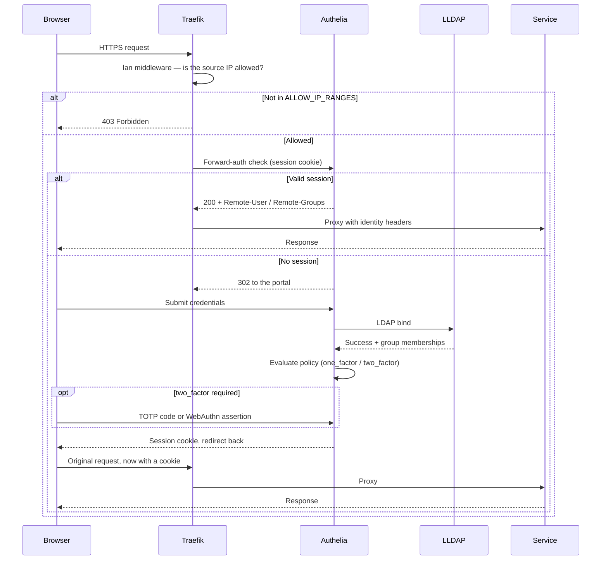
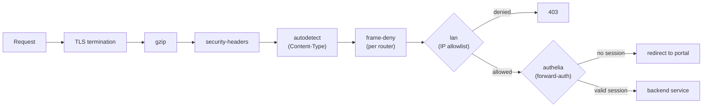

# Security & Authentication

Five layers, in the order a request meets them:

1. **Nothing web-facing is exposed but Traefik** — `443/tcp` and `443/udp` (HTTP/3), with `80/tcp` only redirecting; the DNS-challenge certificates mean port 80 never has to be reachable from the internet. The host also publishes DNS (`53/tcp+udp`, Pi-hole) and the VPN's own UDP ports (`3478`, `41641`) — see [Networking → Ports](NETWORKING.md#ports).
2. **IP allowlist** (`lan` middleware) — only your LAN, your tailnet and the Docker networks reach a service at all.
3. **VPN mesh** — remote access happens over WireGuard, not over an opened port.
4. **SSO** — Authelia, either as forward-auth or as an OIDC provider.
5. **LLDAP** — one directory of users and groups, the single source of truth for both.

The only deliberate exceptions to layer 2 are the Authelia portal and Headscale, both of which must answer from anywhere; each is explained below.

## How a login works

Which mechanism applies to which service is in [Per-service protection](#per-service-protection).

### Forward-auth — for services with no login of their own



### OIDC — for services that can authenticate themselves

Standard authorization-code flow: the service redirects to Authelia's `/authorize`, Authelia authenticates the user against LLDAP (reusing an existing session if there is one), redirects back with a code, and the service exchanges it server-to-server for an ID token — a JWT signed RS256 with the key in `oidc_private_key.pem`. The service verifies the signature and provisions or updates the local user from the claims.

Two consequences specific to this stack: **group membership travels in the `groups` claim**, which is why Nextcloud, Immich, Dockhand and Shelfmark can map the LLDAP `admin` group onto their own roles; and the token exchange is a *container-to-container* call, which is why the Authelia router carries no IP allowlist ([below](#the-middleware-chain)).

**The `groups` claim is not in the ID Token, and it must not be put there.** Since Authelia gained support for the claims parameter the ID Token carries only what proves authorization happened — `groups`, `email`, `name` and `preferred_username` are served from the UserInfo endpoint against the access token. Every client here is fine with that, verified against each one's source: Kavita sets `GetClaimsFromUserInfoEndpoint`, Shelfmark falls back to an explicit `userinfo` call when the token's claims are too sparse, Dockhand merges the UserInfo response over the ID Token, Immich only skips UserInfo when the ID Token already carries `email` (it does not), and Nextcloud's `user_oidc` asks for the claims it needs in the ID Token through the standard claims parameter — which Authelia honours for any claim the client could have reached by scope. So this stack declares **no `claims_policies`**, and the `id_token` escape hatch in that block should stay unused: Authelia's own documentation calls it a break-glass measure for clients with a bug.

**Logging out is not an OIDC operation here.** Authelia implements none of the OIDC logout mechanisms — RP-initiated, front-channel or back-channel — so its discovery document carries no `end_session_endpoint`. Left at that, `user_oidc` falls back to redirecting to the Nextcloud root, where the still-valid portal cookie signs the user straight back in and logging out looks like a page reload. The four clients that expose a logout URL therefore point at Authelia's *portal* logout route instead, with an `rd` back to their own login page: not OIDC, but a browser redirected there carries the session cookie, so the session genuinely ends. Redirect targets sit under the session cookie domain, which is what passes Authelia's `safe-redirection` check. Note the effect is stack-wide, not per-service — ending the Authelia session logs the user out of every other SSO service too.

Only Nextcloud needs the odd-looking trailing `&ignored=`, and it is load-bearing: `user_oidc` appends `?post_logout_redirect_uri=…&client_id=…` unconditionally, so without a parameter to absorb it that second `?` lands inside the `rd` value and corrupts it. The other three parse the URL and merge their own parameters instead — Audiobookshelf and Immich through `openid-client` and `new URL()`, Open WebUI by redirecting to the value verbatim.

| Client | Where the logout URL lives | Set in |
|--------|---------------------------|--------|
| **Nextcloud** | `user_oidc` provider `endSessionEndpoint` | `scripts/nextcloud-oidc-bootstrap.sh` |
| **Audiobookshelf** | `authOpenIDLogoutURL` auth setting | `scripts/audiobookshelf-bootstrap.sh` |
| **Immich** | `oauth.endSessionEndpoint` (takes precedence over discovery) | `config/immich/oauth-config.yaml.template` |
| **Open WebUI** | `WEBUI_AUTH_SIGNOUT_REDIRECT_URL` | `compose.yaml` |

The remaining clients have nowhere to put one, so signing out of them leaves the portal session standing and the next visit signs the user back in: Kavita, Beszel, Dockhand and Headplane expose no such field, Shelfmark implements no logout handling of its own, Homepage hardcodes its sign-out redirect to `/auth/signin?autologin=0` (which is exactly why that escape hatch exists — landing on `/` would auto-login straight back), and Vaultwarden offers no override (it is `SSO_AUTH_ONLY_NOT_SESSION` here in any case). Headscale is not affected — it holds no browser session, only device registrations.

**The LDAP bind is tuned for a busy host, not a fast one.** `authentication_backend.ldap` raises `timeout` to `15s` and enables `pooling` (5 connections, 2 retries). Authelia's 5-second default is shorter than an I/O stall on a host under swap pressure, and a bind that times out *during* a token grant does not fail politely: the client sees a `500`, which for a refresh grant costs it the token it was rotating. Pooling keeps connections warm so a stall costs a retry instead of a session.

That tolerance is not free, and it is not scoped to token grants: `timeout` covers every LDAP operation, and `pooling.timeout` adds up to 10 s waiting for a free connection on top. With LLDAP genuinely wedged, a forward-auth request can now hang ~25 s where it used to fail at 5 s — and Authelia's `/api/health` touches no LDAP, so the container stays healthy and its Uptime Kuma monitor stays green throughout. The trade is deliberate: a slow gated router beats a destroyed session on a vault that has no local fallback, and Authelia caches user details between refreshes rather than binding on every request. If a wedged LLDAP ever needs to fail fast instead, lower `timeout` — do not remove `pooling`, which is what turns a transient stall into a retry.

**Registered clients** — all `consent_mode: implicit`, defined in `config/authelia/configuration.yml.template`:

| Client | Scopes | Auth method | Policy | Notes |
|--------|--------|-------------|--------|-------|
| **Nextcloud** | openid profile email groups offline_access | client_secret_post | one_factor | Group provisioning enabled |
| **Immich** | openid profile email groups | client_secret_post | one_factor | Mobile app callback; `roleClaim` reads `groups`, so `admin` promotes *and* demotes on every login |
| **Beszel** | openid profile email | client_secret_basic | one_factor | PKCE (S256) required |
| **Dockhand** | openid profile email groups | client_secret_post | **admin_only** | 2FA + `admin` group |
| **Headplane** | openid profile email offline_access | client_secret_basic | **admin_only** | 2FA + `admin` group |
| **Headscale** | openid profile email | client_secret_basic | one_factor | VPN device registration |
| **Open WebUI** | openid profile email | client_secret_basic | one_factor | — |
| **Agentgateway** | openid profile email | client_secret_basic | **admin_only** | 2FA + `admin` group. PKCE (S256) required — its browser flow always sends a code challenge |
| **Vaultwarden** | openid profile email offline_access | client_secret_basic | one_factor | Master password still required |
| **Kavita** | openid profile email offline_access | client_secret_post | one_factor | **no `groups` scope** — role sync is off, so the claim would be ignored; roles come from `DefaultRoles` and admin is set in Kavita |
| **Shelfmark** | openid profile email groups | client_secret_basic | one_factor | PKCE (S256) required; admin comes from the `admin` group; local login disabled |
| **Audiobookshelf** | openid profile email | client_secret_basic | one_factor | PKCE (S256) required; **no `groups` scope** — it reads the claim as a role and denies anyone outside admin/user/guest |
| **FreshRSS** | openid profile email | client_secret_basic | one_factor | PKCE (S256) required — the flow runs in Apache (`mod_auth_openidc`), not in FreshRSS, and the module sends a code challenge by default even though the image's `FreshRSS.Apache.conf` never sets `OIDCPKCEMethod`. **No `groups` scope** — FreshRSS derives no roles from the token, so `one_factor` is the whole access decision |
| **Homepage** | openid profile email | client_secret_basic | one_factor | PKCE (S256) required. **No `groups` scope** — homepage has no roles, so `one_factor` is the whole access decision. Its NextAuth provider is declared `idToken: true`, so it never calls UserInfo and sees no `email` or `name` — it needs neither, the only thing it reads off the session is that there is one. One of the two clients that keep forward-auth *as well* (with Headplane): see the matrix below |

`admin_only` is a named policy in the template: deny by default, `two_factor` for members of the `admin` group.

## Per-service protection

| Service | `lan` | `authelia` | Own OIDC | Effective protection |
|---------|:---:|:---:|:---:|----------|
| Authelia portal | — | — | — | Public login entry point. No IP restriction so OIDC clients can reach it server-side; Authelia's own `regulation` handles brute force |
| Headscale | — | — | ✓ | Public by necessity — VPN clients register from anywhere. Bare `/` is a 302 to `/admin` (`headscale-root` + `headscale-root-redirect`), which is Headplane's own router: separately LAN-only + SSO + 2FA. The redirect hands the browser to that router rather than rewriting the path onto the headscale service, which has no `/admin` and answered 404 |
| Nextcloud | ✓ | — | ✓ | LAN-only + OIDC; a second router leaves the public share paths (`/s/`, `/public.php`, …) open. Its `files_external` mounts are **read-write**, so an account in the `admin` group can delete or move anything in the download and library tree — see [Architecture](ARCHITECTURE.md#the-reading-libraries) |
| Immich | ✓ | — | ✓ | LAN-only + OIDC only; password login disabled in `config/immich/oauth-config.yaml.template`, so the shared `PASSWORD` is not a way past Authelia into everyone's photos. Re-enable by flipping `passwordLogin.enabled` and restarting — Immich refuses to let the UI override a config file. Second router leaves share paths (`/share`, `/s/`, `/api`) open |
| Vaultwarden | ✓ | — | ✓ | LAN-only + OIDC + master password — see [below](#vaultwarden). Off `frontend`, on the two-member `vaultwarden_web` segment with Traefik: nothing else has any reason to open `:80` on the vault, and no script does |
| Beszel | ✓ | — | ✓ | LAN-only + OIDC, password login disabled |
| Open WebUI | ✓ | — | ✓ | LAN-only + OIDC |
| Agentgateway | ✓ | — | ✓ | LAN-only + OIDC + admin + 2FA on the UI, run by the gateway itself (`ui.policies.oidc`) rather than by Traefik, which would intercept the `/oauth/callback` that flow returns to. The console reconfigures the whole gateway, so it belongs with Dockhand rather than with the user-facing services. That policy covers the UI **only**, and the other two surfaces on the same port are gated separately: `/v1` by the `llm.policies.apiKey` policy in `strict` mode — a caller with no key gets a 401, which is what lets editors, scripts and n8n reach the models without an interactive login — and an MCP target by whatever policy is attached to it, **none by default** |
| Dockhand | ✓ | — | ✓ | LAN-only + OIDC + admin + 2FA, local login disabled. Off `frontend`, on the two-member `dockhand` segment with Traefik: it reads the Docker socket, so reaching `:3000` from a neighbour is a path to every container on the host. Uptime Kuma watches it over `docker.sock`, not over HTTP; `dockhand-oidc-bootstrap.sh` and `rotate-password.sh` set `DOCKER_CURL_NETWORK` to join that segment |
| Headplane | ✓ | ✓ | ✓ | LAN-only + SSO + OIDC + admin + 2FA |
| Kavita | ✓ | — | ✓ | LAN-only + own accounts / OIDC — OPDS clients can't pass an interactive portal |
| Shelfmark | ✓ | — | ✓ | LAN-only + OIDC only; password login disabled (`DISABLE_LOCAL_AUTH`), so requests and download history stay per-user |
| Audiobookshelf | ✓ | — | ✓ | LAN-only + OIDC only; local login disabled once the bootstrap holds an API key, so the shared `PASSWORD` is not a second way into everyone's listening history. No forward-auth: the mobile apps can't pass an interactive portal, and they have their own OIDC redirect URI |
| FreshRSS | ✓ | — | ✓ | LAN-only + OIDC. Apache's `mod_auth_openidc` guards `/i/` (the whole web UI) and maps `preferred_username` onto a per-user FreshRSS account, auto-created on first sign-in — so Authelia's `one_factor` policy is what decides who has a reading list at all. `/api/greader.php` is deliberately outside that: feed-reader apps can't pass an interactive portal, and it checks the account's own API password. No forward-auth for the same reason (as with Kavita's OPDS clients) |
| n8n | ✓ | — | — | LAN-only + its own auth |
| ntfy | ✓ | — | — | LAN-only + its own accounts and ACLs (`deny-all` default) |
| Homepage | ✓ | ✓ | ✓ | LAN-only + SSO + its own OIDC — all three, as Headplane already does, and here it costs nothing to: `HOMEPAGE_OIDC_AUTO_LOGIN=true` (v2.3.0) sends an unauthenticated visitor straight to Authelia rather than to a page whose only control is a sign-in button, and the forward-auth hop in front has already established that same session — so the dashboard still opens in one hop. Stacking is not redundant: forward-auth only guards the Traefik path, and `/api/*` — which proxies every widget's credentials — is reachable from anything on `frontend` that dials `:3000` with a forged `Host: homepage.<HOST_NAME>`, which is all `HOMEPAGE_ALLOWED_HOSTS` checks. `/api/healthcheck` and `/api/config/custom.css` stay public by design |
| Uptime Kuma | ✓ | ✓ | — | LAN-only + SSO |
| qBittorrent | ✓ | ✓ | — | LAN-only + SSO |
| Prowlarr / Kapowarr | ✓ | ✓ | — | LAN-only + SSO |
| Traefik dashboard | ✓ | ✓ | — | LAN-only + admin + 2FA (the `traefik.<HOST_NAME>` router on `websecure`) |
| Traefik API (`:8080`) | — | — | — | Not on `websecure` at all: the `internalapi` router serves `api@internal` on Traefik's implicit `traefik` entrypoint, reachable only inside `frontend`. `/api/rawdata` returns the full router map, including every public-bypass rule, so it carries `internalapi-allow` — an `ipallowlist` of `172.30.11.240/32`, Homepage's static address and its only consumer |
| Pi-hole | ✓ | ✓ | — | LAN-only + admin + 2FA. The admin UI binds to `127.0.0.1:8082` and `172.30.11.241:8082` only, never `0.0.0.0` — Pi-hole also sits on the `lan` macvlan, where Docker's publishing rules do not apply, so a wildcard bind served the whole LAN (and, through the advertised subnet route, the whole tailnet) at `${PIHOLE_IP}:8082` behind `PASSWORD` alone, bypassing this row entirely. Loopback is for `scripts/pihole-bootstrap.sh`; `172.30.11.241` is what Traefik dials |
| Backrest | ✓ | ✓ | — | LAN-only + admin + 2FA + **its own login**, whose password is per-service (`config/backrest/backrest.env`), not `${PASSWORD}` — the API hands the restic repository password and the S3 keys to any *authenticated* caller, and forward-auth only guards the Traefik path, not the container network. Which is why Backrest is also off `frontend`, on the dedicated `backup` segment: only Traefik and Homepage can open `:9898` at all |
| Gluetun HTTP proxy | — | — | — | Not routed through Traefik at all. `gluetun:8888` is unauthenticated and reachable by anything on `frontend` — gluetun's firewall accepts the whole Docker network by design. Enabled for Shelfmark's direct downloads; the exposure is VPN egress for a container that already has internet, not a path to data |
| LLDAP | ✓ | ✓ | — | LAN-only + 2FA + its own auth + `rate-limit-auth` |
| Stremio | ✓ | — | — | LAN-only; streaming clients and cast receivers can't do the portal |
| Comet | partial | — | — | Split in two routers. `/s/<PUBLIC_API_TOKEN>/` is public so an addon installed on a Stremio account resolves off-tailnet; `/configure` is excluded from it, and `/`, `/health` and `/admin*` stay LAN-only. No forward-auth on either — Stremio fetches manifests programmatically. The public half carries `rate-limit-auth`, because each request fans out to Torrentio/MediaFusion/Zilean from the Pi's WAN IP. Its two passwords are generated per-service (`config/comet/comet.env`), never `${PASSWORD}` |

Services with their own account system (Immich, Kavita, Shelfmark, Audiobookshelf, FreshRSS) deliberately do **not** stack forward-auth on top of OIDC — their apps and clients cannot complete an interactive portal. Homepage and Headplane are not on that list: neither has such clients — both are only ever opened in a browser, which completes both hops.

## The middleware chain

Every request through Traefik:



**Security headers**, on the `websecure` entrypoint:

| Header | Value | Why |
|--------|-------|-----|
| `Strict-Transport-Security` | `max-age=15552000; includeSubDomains` | Force HTTPS for 180 days |
| `X-Content-Type-Options` | `nosniff` | MIME sniffing |
| `Referrer-Policy` | `same-origin` | Referrer leakage |

**`nosniff` needs something to sniff-proof.** Traefik v3 [stopped filling in a missing
`Content-Type`](https://doc.traefik.io/traefik/migrate/v2-to-v3-details/), and the `lan` 403 sets
none — so `nosniff` leaves a WebKit browser nothing to render and it downloads the denial as a
file. `autodetect` restores the v2 behaviour; it is listed **last** on the entrypoint so it wraps
the router middlewares that write such responses. It only fills a `Content-Type` that is absent,
never overriding a backend's own.

**`X-Frame-Options` is separate, and per router.** An entrypoint middleware wraps every router's own middlewares, so its response headers win and no router can opt out. Vaultwarden has to opt out — its `*-connector.html` pages must carry no frame header at all — so the policy lives in a standalone `frame-deny` middleware that each router lists instead. Every router gets `DENY` except Vaultwarden's, which uses `SAMEORIGIN` on the main router and nothing on the connector router (see [Vaultwarden](#vaultwarden)).

List `frame-deny@docker` **first** in a router's chain. Middlewares listed later sit further inside, and anything that short-circuits — the `lan` 403, an Authelia portal redirect, the Stremio redirect — returns without reaching them, so a frame middleware placed last silently omits the header on exactly those responses. Adding a new router means adding it there too; nothing enforces this automatically.

**Rate limiting** — `rate-limit-auth` (10 req/s average per source IP, burst 20, period 1 s) is on two routers: `lldap`, where it sits *before* the forward-auth middleware and blunts credential stuffing, and `comet-public`, where it caps the upstream fan-out (see the Comet row above).

**Why the Authelia portal has neither an allowlist nor a rate limit.** Two reasons, both structural: its SPA fires several API calls on page load and would trip the limiter, and OIDC clients (Open WebUI, Nextcloud, Immich…) make *server-side* calls to its discovery and token endpoints — an IP allowlist would 403 those container-to-container requests. Brute force is handled instead by Authelia's own `regulation` block: `max_retries: 3` within `find_time: 2m`, then `ban_time: 5m`, applied in both modes — `user` and `ip`. IP mode is only sound because Traefik declares no `forwardedHeaders.trustedIPs` and the forward-auth call runs with `trustForwardHeader=false`: while the client's own `X-Forwarded-For` was trusted, the address Authelia regulated on was attacker-chosen, so a per-IP ban was evaded by changing a header. With `user` alone, spraying many usernames from one address locked each account for five minutes and never slowed the caller down.

**Cookie forwarding.** The `authelia` middleware sets `authRequestHeaders=Accept,Cookie,Authorization` so Traefik passes the session cookie on every protected request. Without it, Authelia cannot find the session in Redis and returns a "user state" error.

**Traefik trusts no forwarded header, and neither does the authz call.** Nothing proxies in front of Traefik, so every `X-Forwarded-*` arriving on `websecure` is client-supplied — the entrypoint therefore declares no `forwardedHeaders.trustedIPs` at all. Pairing that with `forwardauth.trustForwardHeader=false` makes Traefik derive the Method/Proto/Host/URI it sends Authelia from the request it actually received. With the previous settings (`trustedIPs=${ALLOW_IP_RANGES}` plus `trustForwardHeader=true`) any LAN or tailnet client could send `X-Forwarded-Host` naming a laxer domain and have Authelia evaluate *that* domain's rule for a request aimed at a gated service.

## Access-control policies

Authelia's rules in evaluation order (`config/authelia/configuration.yml.template`, default policy **deny**):

| Domain | Subject | Policy |
|--------|---------|--------|
| `auth.*` | — | bypass (the portal itself) |
| `uptime.*`, `homepage.*`, `qbittorrent.*`, `prowlarr.*`, `kapowarr.*`, `ai.*` | any user | one_factor |
| `headscale.*` path `/admin` | `admin` group | two_factor |
| `backrest.*`, `pihole.*`, `traefik.*`, `lldap.*` | `admin` group | two_factor |
| anything else | — | **deny** |

**Nothing may follow the `admin` row for those four domains.** Rules are first-match, and a `subject` the user does not satisfy is not a match — so the bare `two_factor` rule for `lldap.*` that sat below it until the OIDC group audit let *every* account into the directory UI and made the admin gate above decorative. A user who needs to change their own password uses LLDAP's reset mail (`LLDAP_SMTP_OPTIONS__ENABLE_PASSWORD_RESET`), not the UI.

**`admin` is the only group that means anything here.** Create it in the LLDAP UI and add your admin accounts; regular users need no group. The deny catch-all applies only to routers carrying the `authelia` middleware — OIDC services enforce their own policy from the client table above.

Two things follow from having exactly one group, and both are load-bearing:

- **LLDAP's own `lldap_*` groups are filtered out of the claim.** `lldap_admin`, `lldap_password_manager` and `lldap_strict_readonly` are the directory's *permission* model, not application roles, and unfiltered they travel to every client that asks for the scope — Nextcloud provisioned real groups from them, and the same class of problem is what forced the `groups` scope off Audiobookshelf. `groups_filter` is therefore `(&(member={dn})(!(cn=lldap_*)))`; LLDAP 0.6 supports both the negation and the `cn` substring. Keep family accounts out of `lldap_strict_readonly` regardless: it grants read access to the whole directory and is not needed to change one's own password.
- **`admin` *is* Nextcloud's superuser group.** Nextcloud's built-in administrators group is called `admin`, so group provisioning maps the LLDAP group straight onto it — adding someone to `admin` to give them a Kavita or Dockhand admin makes them a Nextcloud server administrator too, with write access to the whole library tree through `files_external`. If a per-service admin is ever needed, it needs its own group, not this one.

## Two-factor authentication

Enforced on every admin surface: Traefik, Pi-hole, Backrest and LLDAP through the forward-auth rules, plus Dockhand and Headplane through the `admin_only` OIDC policy.

Users enrol at the Authelia portal under **Security**, with **TOTP** (any authenticator app) or **WebAuthn** (FIDO2 keys, platform authenticators). Save the backup codes.

## Vaultwarden

Served at `https://vault.<HOST_NAME>`. Its data lives in the shared PostgreSQL instance (database and role `vaultwarden`, created by `config/postgres/init-databases.sh`), so it is dumped by `scripts/db-backup.sh vaultwarden` from a Backrest snapshot hook like every other database here. Only attachments, sends and the RSA signing key stay on disk, in `${DATA_LOCATION}/vaultwarden`. It reaches PostgreSQL over its own internal `vault` network, which deliberately does not include LLDAP.

**Accounts.** `SIGNUPS_ALLOWED` is `false`: the router sits behind the LAN allowlist only, so open registration would let anyone on the LAN or the tailnet create a vault. `INVITATIONS_ALLOWED` stays `true`, and `ADMIN_TOKEN` is set, so `/admin` is where you invite people. Read the token with:

```bash
sudo cat ${DATA_LOCATION}/authelia-config/secrets/vaultwarden_admin_token
```

**The admin token is not `PASSWORD`.** `scripts/vaultwarden-pre-start.sh` generates a random token on first start and hands the container only its Argon2id digest, so the plaintext never appears in `compose.yaml`, the container's environment or `docker inspect`. That matters because `/admin` inherits this router's middleware — the LAN allowlist and nothing else, no Authelia forward-auth — so reusing the SSO password would make a `PASSWORD` leak an admin-panel compromise as well. Like the OIDC client secrets and the ntfy passwords, `rotate-password.sh` deliberately leaves it alone; to change it, delete both files and restart.

Vaultwarden accepts a plaintext `ADMIN_TOKEN` but logs a NOTICE about it on every start, and hashing has to happen outside the container because neither tool that can produce a PHC string reads the secret from stdin: `vaultwarden hash` wants a TTY, and Authelia's `crypto hash generate` wants `--password` on argv. The script borrows Authelia's CLI through a throwaway `docker run`, at its default `m=65536,t=3,p=4` — the same cost as Vaultwarden's own `bitwarden` preset.

**Frame headers.** Vaultwarden sets its own `X-Frame-Options` and CSP, and its `/admin` diagnostics validate them end to end — so a reverse proxy that overwrites them shows up there as an `HTTP Response validation` error. Its API needs `SAMEORIGIN`, and `webauthn-connector.html` / `sso-connector.html` need *no* frame header, because the browser extension frames them from a `chrome-extension://` origin that any value would block. That is why these two routers are exempt from `frame-deny` ([above](#the-middleware-chain)); the connector router exists purely to carve those paths out.

**SSO, with consequences.** Authentication is federated to Authelia (client `vaultwarden`, callback `https://vault.<HOST_NAME>/identity/connect/oidc-signin`, which Vaultwarden derives from `DOMAIN` and is not configurable). Two things follow:

- **A master password is still required.** It is the vault's encryption key and never reaches the identity provider. OIDC centralises login and user management; it does not remove the second secret.
- **`SSO_ONLY` is `true`**, so email + master password is refused outright. Every account must be able to sign in through Authelia, which means existing in LLDAP. An invitation only creates a stub account, claimed by signing in via Authelia. There is deliberately **no local fallback**: if Authelia, LLDAP or PostgreSQL is down, nobody can log in. Keep an offline export if that matters to you.
- **`SSO_AUTH_ONLY_NOT_SESSION` is `true`**, so Authelia authenticates the login and nothing more: the session that follows is Vaultwarden's own (access token 2 h, refresh token 7 days idle, renewable). Without it the session rides on Authelia's refresh token, and Authelia rotates those **single-use with no grace period** while the Bitwarden clients refresh even while their access token is still valid — so one refresh response lost to a restart or a transient 500 burns the only token the client holds and locks it out permanently, with a re-login unable to recover it. That failure mode is why this is set.

  **The trade-off is where revocation lives.** Disabling an account in LLDAP or Authelia no longer ends sessions already open — they survive until the Vaultwarden refresh token idles out, up to 7 days. Revoke at `/admin` → the user's **Deauthorize sessions**, which is the authority for a vault anyway. For a password manager on `SSO_ONLY`, being locked *out* of your own credentials is the worse failure of the two; if your threat model reverses that, drop the variable and accept the lockout risk.

Do **not** stack `authelia@docker` forward-auth on this router — the Bitwarden browser extension and mobile clients cannot complete an interactive portal. OIDC is a different mechanism, which they do support.

**Emergency access.** `EMERGENCY_ACCESS_ALLOWED` is `true`, and the flow is entirely email-driven — invite, grant, and the takeover notice that starts the waiting period — so it depends on working SMTP ([Email](EMAIL.md)). Because `SSO_ONLY` is on, a trusted contact also needs an LLDAP account. Someone outside your directory cannot serve as an emergency contact without being added to LLDAP, or `SSO_ONLY` being turned off.

## Secrets

Generated on first start, mode `600`, under `${DATA_LOCATION}/authelia-config/secrets/`, never committed. All but the last two come from `scripts/authelia-pre-start.sh`:

| Secret | Purpose |
|--------|---------|
| `jwt_secret` | Identity token signing |
| `session_secret` | Session cookie signing |
| `storage_encryption_key` | Database credential encryption |
| `oidc_hmac_secret` | OIDC token HMAC |
| `oidc_private_key.pem` | RSA key for JWT RS256 |
| `oidc_<client>_secret.txt` + `_hash` | Per-client shared secrets — plaintext mounted into the client, PBKDF2 hash for Authelia. One pair per client in the table above |
| `db_password` | Authelia's Postgres password |
| `ldap_password` | LLDAP bind password |
| `redis_password` | The shared Redis password — see [below](#the-shared-redis-is-authenticated). Written by `scripts/redis-pre-start.sh` |
| `vaultwarden_admin_token` | Vaultwarden `/admin` token, plaintext — the one you type. Written by `scripts/vaultwarden-pre-start.sh`, never mounted into any container |
| `vaultwarden_admin_token_hash` | Argon2id digest of the above, the only form Vaultwarden receives |
| `freshrss_oidc_crypto_key` | `OIDCCryptoPassphrase` for FreshRSS's `mod_auth_openidc` — it encrypts that module's session cookie and cache, so it is independent of `PASSWORD` and regenerating it only signs everyone out. Written by `scripts/freshrss-pre-start.sh` |
| `homepage_auth_secret` | `HOMEPAGE_AUTH_SECRET` — the key NextAuth signs and encrypts Homepage's session cookie with. Independent of `PASSWORD`; regenerating it only signs everyone out. Written by `scripts/homepage-pre-start.sh` |

Two more are generated per-service under `${DATA_LOCATION}`, mode `600`, for the same reason as the
Vaultwarden token — `llm.<HOST_NAME>` carries no forward-auth, so a `PASSWORD` leak must not also be
admin over it:

| Secret | Purpose |
|--------|---------|
| `agentgateway/secrets/cookie_secret` | AES-256-GCM key for agentgateway's OIDC session cookie. Regenerating it only logs everyone out |
| `agentgateway/secrets/llm_api_key` | The virtual key every `/v1` caller presents. Exported as `sk-<key>` into the gateway's own `apiKey` policy and into the `open-webui` entrypoint from the same file, so the caller and the gateway cannot disagree. Open WebUI mounts **this file alone**, not the directory: the cookie secret next to it signs admin sessions |

`scripts/agentgateway-pre-start.sh` copies those two and the OIDC client secret into
`config/agentgateway/agentgateway.env` (mode `600`, gitignored), because the agentgateway image is
distroless — no shell — so the `export $(cat …)` entrypoint the other services use is not available and
an `env_file` is. Those values are frozen at container creation: pick a change up with
`docker compose up -d agentgateway`, not `restart`.

Two more live outside that directory, in `config/comet/comet.env` (mode `600`, gitignored), written by
`scripts/comet-pre-start.sh`: `ADMIN_DASHBOARD_PASSWORD` and `CONFIGURE_PAGE_PASSWORD`, the credentials
for Comet's `/admin` and `/configure` pages. Generated per-service rather than reusing `PASSWORD`, for the
same reason as the Vaultwarden token — Comet has no forward-auth in front of it, and `/configure` is where
a user's debrid API key is stored. Read the one you need with `grep CONFIGURE_PAGE_PASSWORD
config/comet/comet.env`. Neither feeds `PUBLIC_API_TOKEN`, which lives in the `comet_data` volume, so
rotating them leaves every installed Stremio addon URL valid — but `env_file` values are frozen at
container creation, so pick them up with `docker compose up -d comet`, not `restart`.

OIDC client secrets are injected into services through read-only Docker volumes, or written into the
service's own configuration file by its bootstrap script (Kavita's `appsettings.json`, Shelfmark's
`plugins/security.json`) or pushed over its admin API (Audiobookshelf's `PATCH /api/auth-settings`, whose
settings live only in its SQLite database) — never through environment variables, where `docker inspect`
would print them, and never baked into images.

**A rendered file that carries a secret is 0600 from creation.** `lib.sh`'s `write_secret_file` renders
into a `mktemp` file — 0600 before a byte is written — and `mv`s it into place, rather than `cmd > file`
followed by a `chmod`, which creates the file world-readable with the secret already in it and narrows it
only on the next line. It covers `config/headscale/config.yaml` and `config/headplane/config.yaml` (each
holds its Authelia OIDC `client_secret`, and Headplane's also holds a reusable pre-auth key),
`${DATA_LOCATION}/qbittorrent/qBittorrent/qBittorrent.conf` (qBittorrent writes `WebUI\Password_PBKDF2`
and the ntfy bearer token back into it), `config/backrest/backrest.env`, `config/ntfy/ntfy.env` and
`config/n8n/n8n.env`.

**Rotating one of these: `make rotate-secret TARGET=<name>`.** `rotate-password.sh` covers the shared
`PASSWORD` and everything derived from it; the secrets in this section are not, so they get their own
command. What it exists for is not generating a value but reaching every consumer: rotating Backrest's
API password without `config/homepage/secrets/backrest_password` leaves the Homepage widget answering
401, rotating a restic password without `config.json` locks Backrest out of its own repository, and
rotating the S3 keys without Beszel's PocketBase settings breaks its nightly backup silently. Each
target verifies its own effect and restores what it touched if that verification fails - except past
`restic key passwd`, where the old password no longer opens the repository and restoring it would be
the opposite of a repair. `make check-secrets` runs the verifications alone, which also catches drift
no rotation caused.

`config/n8n/n8n.env` (mode `600`, gitignored) holds one value, `N8N_RUNNERS_AUTH_TOKEN`, written by
`scripts/n8n-pre-start.sh` and loaded by both `n8n` and `n8n-runners` as an `env_file`. It used to be
`${N8N_RUNNERS_AUTH_TOKEN:-<a hard-coded default>}` in `compose.yaml` with the variable set nowhere, so every
install ran the task broker on the same published default while it listened on `0.0.0.0` inside
`frontend` — any of the containers there could register as a task runner and receive the workflow code
and data n8n hands out for execution. Like the Comet and Vaultwarden secrets it is machine-to-machine, so
`rotate-password.sh` leaves it alone; rotate by deleting the file and running
`docker compose up -d n8n n8n-runners`.

## The shared Redis is authenticated

The one Valkey instance holds Authelia's **session store** (database 1) next to Immich's and
Nextcloud's caches, and it used to run with no authentication at all:

```
user default on nopass ~* &* +@all
```

Seven containers can open `redis:6379` — `authelia`, `lldap`, `postgres`, `backrest`,
`immich-server`, `immich-machine-learning` and `nextcloud`, through the `auth`, `immich` and
`nextcloud` segments. All seven are core services, which is why this was a latent hole rather than a
live one; what it did block was extending the cache to anything less trusted, because a peer on that
network can read or forge an SSO session. A per-service ACL user would not have helped while
`default` stayed open — the new user is simply not the one a client has to use.

So `requirepass` is set, from a generated secret. Not `PASSWORD`: nothing here has to type it, every
consumer reads it from a file, and keeping it independent means `rotate-password.sh` has no
four-service restart to sequence. Rotate it with `make rotate-secret TARGET=redis-auth`, which
re-renders, restarts Valkey and recreates the three consumers in that order. Every one of those
containers is recreated with `--force-recreate`: the secret is a bind-mounted *file*, so rotating it
leaves the service definition byte-identical and a plain `up -d` would find a matching config hash
and do nothing.

| Where the value lands | How |
|---|---|
| Valkey | `requirepass`, rendered by `scripts/redis-pre-start.sh` into `${DATA_LOCATION}/redis/redis-auth.conf`, which `config/redis/valkey.conf` pulls in with `include`. That file is a versioned mount, so the secret cannot live in it |
| Authelia | `session.redis.password`, as `{{ secret "/config/secrets/redis_password" }}` |
| Immich | `REDIS_PASSWORD_FILE`, read by `server/bin/start.sh` as root before the server starts |
| Nextcloud | `REDIS_HOST_PASSWORD_FILE`, read by `file_env` in the image entrypoint as root — and re-read per request by `config/redis.config.php`, so it points at the `0644` copy below |

No consumer takes it as an environment variable, so `docker inspect` shows none of them holding it.

**The two files under `${DATA_LOCATION}/redis` are `0644`, and that is deliberate.** They are the
only secrets in this stack that are not `0600`, because the processes that read them are not root:
the Valkey entrypoint re-execs the server under `setpriv --reuid=valkey --clear-groups` (uid 999),
and Nextcloud's cron and post-installation hooks run as `www-data` (uid 33) — while the hook that
writes them runs as root under systemd and as the project owner under `make update`. Neither of those
can hand a file to 999 or 33 without the other losing access to it. A bind-mounted file is reached by
its own mode inside the container while the host still has to traverse the directory, so
`${DATA_LOCATION}/redis` is `0700` and carries the protection — the same way the Authelia secrets
directory does under a `0777` `DATA_LOCATION`. The authoritative copy in the secrets directory stays
`0600`.

The Nextcloud copy exists because `_FILE` is not resolved once. The image's `file_env` exports
`REDIS_HOST_PASSWORD` and unsets the `_FILE` variable for Apache, but `config/redis.config.php` keeps
the `_FILE` branch and re-evaluates it on every request — and `docker exec -u www-data` gets the
container's *configured* environment, not the entrypoint's exports. `nextcloud-cron.service` and the
documented `20-external-storage.sh` invocation would otherwise authenticate with an empty string and
fail with `NOAUTH`.

**The healthcheck authenticates now, and matches on the reply.** `redis-cli ping` exits 0 while
printing `NOAUTH Authentication required`, so the previous probe would have reported a healthy cache
that every client in the stack was being rejected by. It reads the password from the mounted file and
greps for `PONG`; `make check-secrets` proves the same thing from outside.

## Network segmentation

Every service that needs nothing but an ingress route gets a two-member segment
with Traefik rather than a seat on `frontend`. `backup`, `dockhand` and
`vaultwarden_web` are that pattern; `auth`, `immich`, `nextcloud`, `ai`, `vault`,
`rss` and `ntfy` are the `internal: true` data segments behind it. Three
single-member networks — `egress_unbound`, `egress_immich`, `egress_ddns` — exist
only because a bridge is the sole way to give a container the internet: their
occupants need egress and no peer at all, so one member is the correct size.

`frontend` still carries ~20 containers, and inside it there is no isolation:
any member can open any other member's `expose`d port, with no Traefik and so no
`lan` middleware and no forward-auth in the path. That is a property of a Docker
bridge, not a misconfiguration — `enable_icc=false` would also cut Traefik off
from its own backends. The mitigation is to keep moving services out, which is
why the list above grows.

**Docker's default address pool must not be used.** Left alone the daemon hands
out `/16`s from `172.17.0.0/12` — fifteen in total, which this stack came within
one of exhausting — and only `172.30.0.0/16` is inside `ALLOW_IP_RANGES`. A
network that lands outside it makes Traefik answer a bare 403 with nothing in the
logs to explain it. `install.sh` writes `/etc/docker/daemon.json` with a
`172.30.128.0/17` base in `/24` chunks: 128 networks, all inside the allowlist,
and starting at `.128` so auto-allocation can never collide with the subnets
`compose.yaml` pins by hand (`172.30.11/12/13/14/15/53`). On an existing host the
installer says what to add rather than rewriting the file.

No IPv6 pool is needed alongside it: both IPv6 subnets are pinned in
`compose.yaml`, so nothing is auto-allocated. The file does gain `"ip6tables":
true`, stated rather than inherited, because the `[::]` publishes depend on it -
without it the daemon programs no IPv6 DNAT and `docker-proxy` rewrites every
client address. On a host that already has a `daemon.json` the installer only
warns, as it does for the address pool.

## Accepted risks

Deliberate trade-offs rather than oversights. Each is written down so it is not
rediscovered as a finding, and so the reasoning can be revisited if the balance
changes.

**`system-tools` answers without authentication to anything on `frontend`.** Its
`/status/{topic}` endpoints are readable by every container on that network,
including the two internet-facing ones. Measured on a healthy stack, that
discloses the tailnet inventory (device names and their owners, 11 lines) and
little else; `/status/errors` returns the log tail of whatever is failing, which
is empty in normal operation but is the part worth having during an incident,
since a crashing service often prints a connection string. Reaching any of it
requires code execution in a frontend container first.

Binding the listener to the `ai` network instead - the fix used for Pi-hole's
admin UI - does not work here: Uptime Kuma is not on `ai`, it reads
`/health/backups` over `frontend`, and uvicorn binds one address. Putting Uptime
Kuma on `ai` would be worse, since its own auth is disabled and `ai` is where
Open WebUI runs admin-supplied Python. So the real option is a bearer token,
which both consumers support natively (Open WebUI's tool server already carries
`auth_type`/`key` fields, Uptime Kuma monitors take custom headers). That is five
integration points and a tenth `rotate-secret` target, weighed against a
conditional disclosure behind a prerequisite compromise - deferred, not dismissed.

**FreshRSS writes its whole environment to a world-readable file inside its own
container.** Setting `CRON_MIN` is what installs the image's refresh crontab, and
the entrypoint's way of handing the environment to that cron job is to dump
`/proc/self/environ` to `/var/www/FreshRSS/Docker/env.txt`, mode 0644 — so the
OIDC client secret and the `freshrss` Postgres password are readable by any
process in that container. It sits in the container's writable layer, outside the
`/var/www/FreshRSS/data` mount, so it never reaches the host data disk or a
Backrest snapshot, and the only other process in there is Apache running the
application those values belong to. The alternative is dropping `CRON_MIN` and
having feeds refresh only when a browser is open, which is not a reader.

**Pi-hole's public upstreams see a share of normal traffic.** See
[Networking → The DNS pipeline](NETWORKING.md#the-dns-pipeline): dnsmasq spreads
queries rather than treating Unbound as primary, and the `strict-order` that
would change it leaves DNSSEC-bogus domains hanging with no answer at all.
Cloudflare and Quad9 both validate DNSSEC, so the cost is privacy, not integrity.

**The VPN and the download tooling are one-factor.** Any LLDAP account can join
the tailnet (the `headscale` OIDC client is `one_factor`, with no group filter and
an ACL that grants the full LAN subnet), and any LLDAP account reaches
qBittorrent, Prowlarr and Kapowarr - where Prowlarr's UI exposes indexer
credentials and its API key. Both were raised and kept: this is a household
stack, and 2FA on every family device was judged the larger cost.

**`ALLOW_IP_RANGES` includes `172.30.0.0/16`.** Every container therefore passes
`lan@docker`, so a compromised one can reach any `lan`-gated router through
Traefik. Narrowing it means pinning static addresses for Uptime Kuma's probes and
the tailnet and host gateways; the services behind those routers each have their
own login, so the gain was judged smaller than the breakage risk. It has no IPv6
counterpart: only Traefik has an IPv6 address and it never calls itself, so the
one source that could come from `ingress6` is its gateway - the address
`docker-proxy` substitutes when the IPv6 DNAT is missing. Admitting it would turn
that failure into an open door instead of a `403`.

**`HOST_LAN_SUBNET6` allowlists a globally routable prefix.** It admits what
`192.168.1.0/24` admits - every device on your LAN. Being routable where private
IPv4 is not changes nothing: a source address cannot be forged through a TCP
handshake, so only devices actually on the link present one from that range. Same
staleness risk as `WAN_HAIRPIN_IP` below, bounded by the same 15-minute timer.

**The IPv6 surface is one container, by construction.** Traefik alone has an IPv6
address, so no other *container* is reachable over IPv6 whatever the router
allows - a stronger guarantee than a firewall rule, because there is nothing to
reach. `:53` and `:3478` stay IPv4-only to keep it that way; see
[Networking → IPv6](NETWORKING.md#ipv6) for the measurements behind both.

That does **not** extend to the host, which is the reason the router rule has to
name `443` and not the Pi. `sshd` listens on `[::]:22` and `tailscaled` on
`41641/udp` in both families, and IPv6 has no NAT in front of either. A rule
opened wholesale to the Pi publishes SSH to the internet.

**`WAN_HAIRPIN_IP` allowlists the line's own public address.** IPv4 only: with no
NAT, an IPv6 client is never hairpinned. It is how a LAN
client that resolves through the router instead of Pi-hole gets past `lan@docker`:
the router hairpins the connection back inside with the source SNAT'd to its WAN
address. Only a connection that left the LAN is hairpinned, so on a line whose
address is not shared this admits no new source - a request from the internet
keeps its own. On a CGNAT line it would admit every co-subscriber, which is why
`wan-allowlist-sync.sh` refuses any address in CGNAT or private space rather than
trusting the operator to notice.

The risk that remains is staleness: after the line's address moves, the entry
admits whoever inherits it, gated only by each service's own login - and several
`lan`-only routers have no login at all. `pi-pcloud-wan-allowlist.timer` bounds
that to 15 minutes, using `tailscale netcheck` (a STUN view of the current
address) rather than `ddns-updater`'s state file, which only records what was
last published and would confirm a stale value indefinitely. What is left is a
window of one timer interval, plus however long a broken `tailscaled` goes
unnoticed - in which case the script logs a warning and changes nothing.

**Pi-hole no longer blocks iCloud Private Relay.**
`dns.specialDomains.iCloudPrivateRelay` is off, so `mask.icloud.com` resolves and
Safari traffic on Apple devices leaves through Apple's relay, unfiltered and with
its DNS answered by Apple rather than Pi-hole. The default was costing more than
it bought: the block surfaces on an iPhone as "Private Relay is unavailable on
this network", and chasing that warning is what put IPv6 back on at the router -
whereupon the router's RA took every client off Pi-hole entirely, split-horizon
DNS included. Local names still resolve through Pi-hole because the relay is
bypassed for names that answer with a private address. `mozillaCanary` and
`designatedResolver`, the two other anti-bypass defaults, stay on.

**Authelia binds to LLDAP as the directory's super-admin.** A dedicated service
account in `lldap_password_manager` would be tighter - password reset is enabled,
so read-only is not an option - but it needs its own bootstrap, secret and
rotation path.

## Sessions

Sessions live in Redis; persistent state (preferences, TOTP and WebAuthn credentials) lives in PostgreSQL. Cookies are **Secure + HttpOnly, SameSite=Lax**, with a **45-minute inactivity timeout**, a **12-hour absolute expiry**, and **1 month** for "remember me".

## Operating it

- **After a leak**, rotate with `make rotate-password` (LLDAP admin + Authelia — the actual SSO master credential) or `make rotate-password-full` (also every Postgres role and every other service using `PASSWORD`). See [Configuration → Changing passwords](CONFIGURATION.md#changing-passwords).
- **Failed logins reach your phone.** The Authelia log watcher publishes them to the ntfy `security` topic, including regulation bans and rejected OIDC grants — see [Monitoring](MONITORING.md#authelia-log-alerts).
- **Encryption at rest is not the default.** TLS covers transport and restic encrypts the backups, but Postgres and Redis data on disk is plain. Put `DATA_LOCATION` on an encrypted filesystem (LUKS) if that matters to you.
